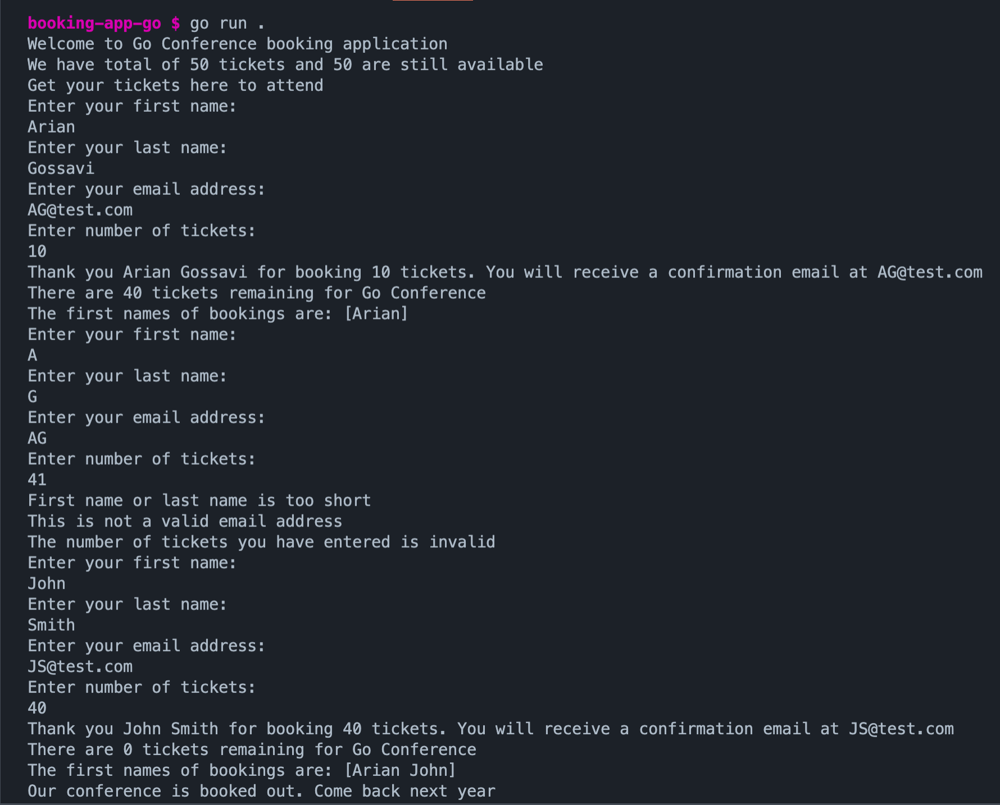

## TICKET BOOKING APPLICATION written in Golang

# Summary

This application was built following a Golang tutorial, to help learn the fundamentals of the language such as types, loops, pointers & packages. The user is able to input their details and select the number of tickets they would like to book. There is user validation functionality to ensure the user information and ticket order is valid and the application will end when the tickets are sold out. Below is a demo of the application:

# Screenshot

